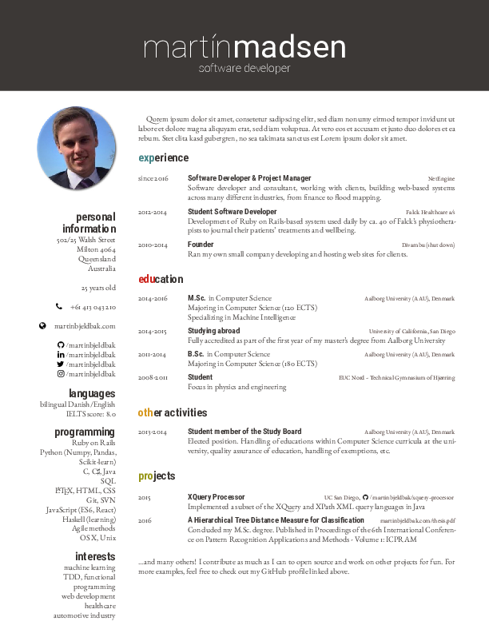

# Icyd's resume latex's template

Based on the [Martin Madsen's CV](https://github.com/martinbjeldbak/CV), 
modifing the color pallette ([Gruvbox](https://github.com/morhetz/gruvbox) is 
used instead), Helvetica is replaced with paired fonts Roboto and EB Garamond, 
and the icons are [font-awesome](http://fortawesome.github.io/Font-Awesome/), 
no bibliography, loads [microtype](https://www.ctan.org/pkg/microtype?lang=en) 
and some other minor modifications.

